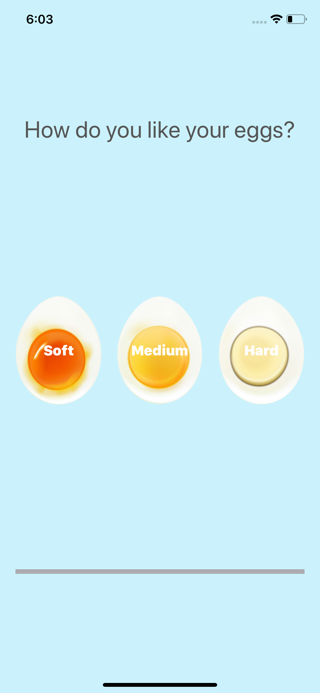

#  Egg Timer

An egg timer app to boil eggs to perfection depending on how "cooked" one wants.

## Screenshots

## What I have learned

* Swift Collection types - Dictionaries
* The Swift Timer API
* Conditional statements - IF/ELSE
* Conditional statements - Switch
* Functions with outputs
* How to use the ProgressView

## Credits

>This is a companion project to The App Brewery's Complete App Development Bootcamp, full course at [www.appbrewery.co](https://www.appbrewery.co/)
